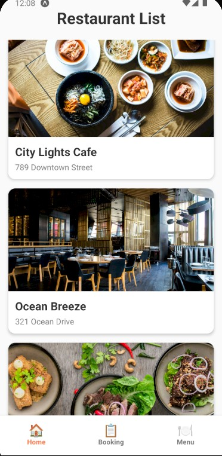
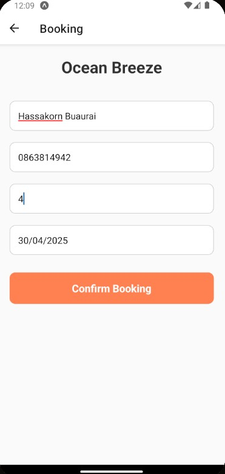
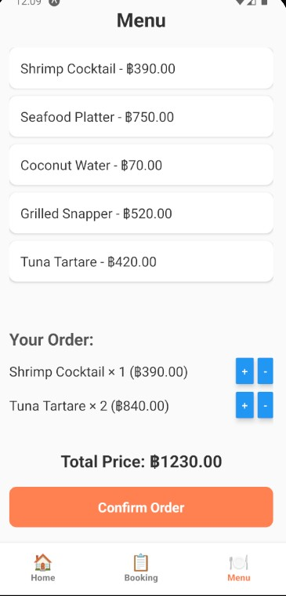
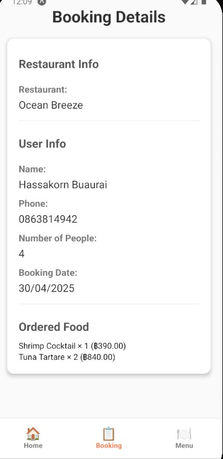

แบบฟอร์มส่งงานสอบ Take-home | Take-home Assignment Template
ชื่อ - นามสกุล (Full Name): Hassakorn Buaurai

รหัสนักศึกษา (Student ID):6631503127

ชื่อแอป (App Name): Restaurant Reservation & Order App

Framework ที่ใช้ (Framework Used): React Native (Expo)

ลิงก์ GitHub Repository:[https://github.com/HassakornBuraurai/FinalExam-MobileApp]

ลิงก์ไฟล์ติดตั้ง (APK/IPA): [https://drive.google.com/drive/folders/1ES9fTQwTVeuxR86Tv7pzMKR9Ba9-9NDr?usp=drive_link]

1. App Concept and Design (2 pts)

1.1 User Personas

Persona 1:

Name: May

Age: 21

Occupation: University Student

Needs: Wants to quickly book restaurant tables and pre-order food easily.

Persona 2:

Name: Golf

Age: 25

Occupation: Office Worker

Needs: Wants to find restaurants easily and pre-order meals before arriving.

1.2 App Goals

- Allow users to book restaurant tables easily and quickly.

- Allow users to pre-order food after booking.

- Display a summary of booking and ordered food clearly.

1.3 Mockup / Main Screens Description

1. Home Screen:

Shows a list of 10 restaurants (image, name, address).

2. Booking Screen:

Form to input Name, Phone Number, Number of People, Booking Date.

Confirm button only appears when all fields are filled correctly.

3. Booking Status Screen:

Displays all booking details + list of ordered food.

4. Menu Order Screen:

User can select menu items, set quantity, and confirm the order.

Order summary is saved and shown in Booking Status.

1.4 User Flow

Open App → Select a Restaurant → Fill Booking Form → Select Menu Items → Confirm Order → View Details on Booking Status

2. App Implementation (4 pts)

2.1 Development Details

Tools Used:

- Expo SDK 50

- React Native 0.73

- React Navigation

- Context API (BookingContext)

2.2 Features Implemented
Checklist:

 Display restaurant list (Home Screen)

 Table booking system (Booking Screen)

 Form validation before confirming booking

 Menu selection and order confirmation (Menu Order Screen)

 Display full booking and order summary (Booking Status Screen)

2.3 App Screenshots
(Attach screenshots or image links, for example:)

3. App Build and Installation (2 pts)

3.1 Build Type
[x] Debug
[ ] Release

3.2 Platform Tested
[x] Android
[ ] iOS

3.3 README and Installation Instructions

Download the .apk file

Open it on an Android device

Install it through File Manager or use Expo Go

4. Reflection (2 pts)
Learning Outcomes:

- Learned how to manage global app state using Context API.

- Practiced form validation for booking input.

- Learned to build navigation flows with beautiful UI design.

- If more time was available, I would add Booking History and improve the order management system.

5. AI Assisted Development (Bonus Section)

5.1 AI Used for Idea Generation

Prompt Used:"Suggest mobile app ideas for restaurant booking and food ordering."

Result: Got the idea to combine restaurant reservation and food pre-ordering in a single app.

5.2 AI Used for UI Layout Design

Prompt Used: "Design a restaurant list screen and booking form for a mobile app."

Result:Helped create clean layout ideas with modern color themes.

5.3 AI Used for Code Writing

Prompt Used:"React Native code for bottom tab navigation and booking form validation."

Result:Used the code structure to implement the navigation and form flow.

5.4 AI Used for Debugging

Prompt Used:"React Native Expo project error RNCMaterialDatePicker not found."

Result:Got suggestions to switch to Expo-friendly Date Picker and use calendar modal instead.

